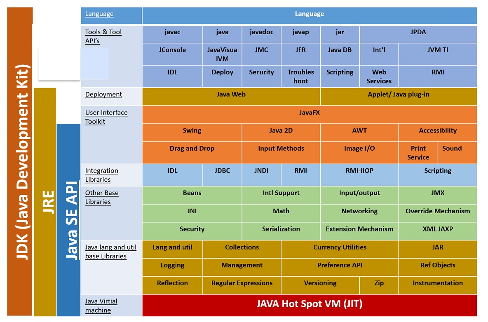
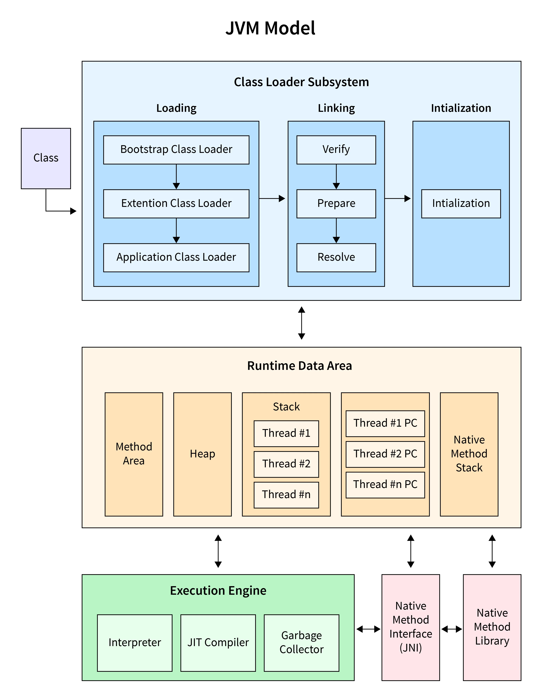

# JDK, JRE, and JVM Architecture

## Java Virtual Machine (JVM)

### Role

- The JVM is responsible for executing Java bytecode. It abstracts the underlying hardware and operating system, ensuring portability.
- JVM and JRE are operating system-dependent because they include platform-specific components (such as system libraries and OS-level interaction).
- For cross-platform Java applications, you would install the appropriate JVM or JRE version for your operating system.

### Architecture

#### Class Loader Subsystem

- **Bootstrap Class Loader**: Loads core Java classes (e.g., `java.lang.*`).
- **Extension Class Loader**: Loads classes from extension directories.
- **Application Class Loader**: Loads classes from the application’s classpath.

#### Memory Areas

1. **Method Area**: Stores class metadata (method code, static variables).
2. **Heap**: Stores objects and is garbage-collected.
3. **Stack**: Stores local variables, operands, and references.
4. **Program Counter Register**: Tracks the current JVM instruction to execute.
5. **Native Method Stack**: Stores native method data.

#### Execution Engine

- **Interpreter**: Executes bytecode line-by-line.
- **JIT Compiler**: Converts bytecode to native machine code.
- **Garbage Collector**: Manages memory by reclaiming unused objects.

#### Native Interface

- Interacts with native libraries (e.g., through JNI).

---

## Java Runtime Environment (JRE)

### Role

The JRE provides the runtime environment for running Java applications. It includes the JVM and necessary class libraries.

### Components

1. **JVM**: Executes Java bytecode.
2. **Java Class Libraries**: Pre-built classes (`java.io`, `java.net`).
3. **Support Files**: Configuration and native code files.

---

## Java Development Kit (JDK)

### Role

The JDK is a full development environment for building Java applications. It includes the JRE along with development tools.

### Components

1. **JRE**: Provides the runtime environment.
2. **Development Tools**:
   - **Java Compiler (`javac`)**: Compiles Java source code to bytecode.
   - **Java Debugger (`jdb`)**: Assists in debugging Java programs.
   - **Archiver (`jar`)**: Packages classes into JAR files.
   - **Documentation Generator (`javadoc`)**: Creates HTML documentation.
3. **Other Tools**:
   - **JavaFX** (GUI development).
   - Profiling and monitoring tools like `jconsole`.

---

## Comparison Table

| **Aspect**          | **JVM**                                  | **JRE**                                                                                                                                                                                                                                                                      | **JDK**                                                                                                                                                                              |
| ------------------- | ---------------------------------------- | ---------------------------------------------------------------------------------------------------------------------------------------------------------------------------------------------------------------------------------------------------------------------------- | ------------------------------------------------------------------------------------------------------------------------------------------------------------------------------------ |
| **Purpose**         | Executes Java bytecode.                  | Runs Java programs.                                                                                                                                                                                                                                                          | Develops and runs Java programs.                                                                                                                                                     |
| **Includes**        | Only the execution engine.               | JVM + Standard Class Libraries.                                                                                                                                                                                                                                              | JRE + Development Tools + Additional Libraries.                                                                                                                                      |
| **Execution**       | Executes bytecode using interpreter/JIT. | Provides runtime for Java applications.                                                                                                                                                                                                                                      | Compiles, debugs, and runs Java applications.                                                                                                                                        |
| **Tools Included**  | None                                     | None                                                                                                                                                                                                                                                                         | - Java Compiler (`javac`) - Debugger (`jdb`) - Archiver (`jar`) - Documentation Generator (`javadoc`) - Monitoring Tools (`jconsole`, `jvisualvm`) - JavaFX and more. |
| **Class Libraries** | None                                     | - Core Libraries (e.g., `java.lang`, `java.util`)  - Input/Output Libraries (`java.io`, `java.nio`)  - Networking (`java.net`)  - Graphics (`java.awt`, `javax.swing`)  - XML Parsing (`javax.xml`)  - Security (`java.security`)  - Database (`java.sql`) | Includes all libraries from JRE plus additional libraries for tools (e.g., `tools.jar`).                                                                                             |
| **Target Audience** | Runtime execution environment only.      | Users running applications.                                                                                                                                                                                                                                                  | Developers creating, testing, and deploying applications.                                                                                                                            |

🚀 Thanks for checking out these notes! Keep coding, experimenting, and growing—let's continue learning and building together! 💻🧑‍💻
